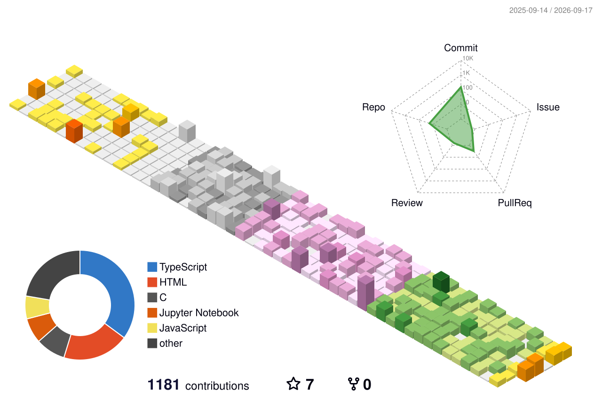

  

### Who I Am

<small>
I'm an AI engineer and full-stack developer who enjoys building things from scratch and figuring out how to make them actually work in the real world. I studied Artificial Intelligence (Data Science) at UMT, and my work usually sits somewhere between AI and product engineering, whether that's RAG, agents, computer vision, or a full-stack application around a model.
</small>

<small>
I've built 40+ projects over the past three years, worked with clients across healthcare, legal, and education, and somehow ended up with a few research papers along the way. I also really enjoy hackathons, with two 1st-place Devpost wins so far against 1,800+ and 850+ teams.
</small>

### These Days

<small>
- Solving real-world problems for clients across healthcare, fintech, edtech, legal, and other domains, using AI where it actually makes sense.  
- Exploring multimodal models, agentic AI, RAG, and new approaches to building reliable AI systems.  
- Currently building <b>JitterStack</b> and working on AI products, systems, and use cases from idea to production.  
- Still reading <i><b>Attention Is All You Need</b></i>. Nine years (less than a decade) later, apparently attention is still all I need... plus GPUs, datasets, and a questionable amount of coffee.  
</small>

### Tech Stack

<small>What actually shows up in my repos, grouped roughly by what it's for.</small>

<table width="100%" align="center" style="border: none;">
<tr style="border: none;">

<td valign="top" width="50%" align="center" style="border: none;">

<b>Languages</b>

<b>ML / DL / CV</b>

<b>GenAI & Agents</b>

<b>Data & Analytics</b>

</td>

<td valign="top" width="50%" align="center" style="border: none;">

<b>Backend</b>

<b>Frontend</b>

<b>Data & Databases</b>

<b>DevOps & Cloud</b>

</td>

</tr>
</table>

### Featured Projects

| Project | What it does | Stack | Links |
|---|---|---|---|
| **TrustECG** | Attention-based residual CNN that classifies 5 cardiac conditions from 12-lead ECGs (PTB-XL), achieving 91%+ AUROC with lead-level explanations. | PyTorch, Attention-CNN, Streamlit | [GitHub](https://github.com/Kaleemullah-Younas/TrustECG) |
| **Sehat Guftagu** | Bilingual Urdu/English clinical interview and triage system with voice/text interviews, SOAP reports, and emergency flagging. | Next.js, LangGraph, Groq, Pinecone RAG, ElevenLabs | [GitHub](https://github.com/Kaleemullah-Younas/Sehat_Guftagu-Interview_version) |
| **LegalEdge AI** | Multi-agent system with four specialized agents for contract and compliance review, reducing review time by roughly 70%. | Python, Streamlit, Gemini 2.0, ChromaDB | Confidential |
| **CHAPAL** | LLM safety layer combining deterministic prompt-injection/PII protection with semantic hallucination detection and human review. | Next.js, TypeScript, Prisma, Groq, Gemini | [GitHub](https://github.com/Kaleemullah-Younas/CHAPAL) |
| **Querywise** | Multi-agent RAG using hybrid BM25 + embedding retrieval with answer verification before returning results. | LangChain, LangGraph, ChromaDB, Docling | [GitHub](https://github.com/Kaleemullah-Younas/Querywise) |
| **Mail Detective Agent** | Three-agent system that analyzes student inboxes and ranks scholarships and internships against their academic profile. | Next.js, tRPC, MongoDB, Prisma, GLM | [GitHub](https://github.com/Kaleemullah-Younas/Mail-Detective-Agent) |
| **Real-Time Twitter Sentiment Analysis** | Real-time tweet classification pipeline using Kafka and PySpark MLlib with MongoDB storage and a live dashboard. | Kafka, PySpark, MongoDB, Django, Docker | [GitHub](https://github.com/Kaleemullah-Younas/Real-time-twitter-Sentiment-Analysis) |
| **IDS-WSN** | ML-based intrusion detection for Blackhole, Grayhole, and Flooding attacks in wireless sensor networks, optimized for edge devices. | Scikit-learn, SMOTE | [GitHub](https://github.com/Kaleemullah-Younas/Intrusion-Detection-System) |

  <a href="https://github.com/Kaleemullah-Younas?tab=repositories">More on my GitHub</a>

### Achievements

🥇 1st - 2 international AI hackathons on Devpost (1,800+ & 850+ teams) 
🥇 1st - TechVerse'26, UMT (Agentic AI healthcare, 25+ teams) 
🥇 1st - TechVerse'25, UMT (Generative AI, 20+ teams) 
🥈 2nd - Softec'25 Kaggle, FAST (40+ teams) 
🏅 Top 5 - NaSCon'25, FAST Islamabad (Agentic AI & MCP, 100+ teams) 
🎓 3.87/4.0 GPA · 8× Dean's Award (2022–2026) 
📜 IBM RAG & Agentic AI · AI Engineer for Data Scientists

---

Latest posts from <a href="https://medium.com/@kaleemullahyounas123">Medium</a>, auto-updated daily via GitHub Actions:

### Get in Touch

  <i>"The secret of getting ahead is getting started."</i>
   
  <i> Mark Twain</i>

My party parrots:

  
                   

<picture>
  <source media="(prefers-color-scheme: dark)" srcset="profile-3d-contrib/profile-night-rainbow.svg" />
  
</picture>
